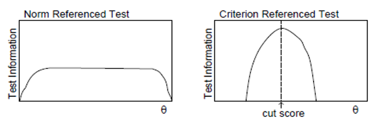

<!-- options(download.file.method="libcurl") -->

```{r setup, include=FALSE}
knitr::opts_chunk$set(
	echo = TRUE,
	message = FALSE,
	warning = FALSE
)
options(digits=3)
library(dplyr)
library(tidyverse)
library(dplyr)
library(tuev)
library(emo)
library(knitr)

```


<br>
<br>
.center[

##  `r fontawesome::fa(name = "handshake")`: Kübra Atalay Kabasakal
<br>
--
<br>

##  `r fontawesome::fa(name = "link")`: [Hacettepe Üniversitesi](https://avesis.hacettepe.edu.tr/katalay)
<br>
--
<br>
]
---

## Madde Tepki Kuramı (MTK) ile Madde Analizi Uygulaması

- iki kategorili (doğru-yanlış) MTK modelleri

--

- madde ve yetenek parametresi kestirimi

--

- madde karakteristik eğrisi çizimi ve yorumlanması

--

- model-veri uyumunun incelenmesi

--

- madde ve test bilgi fonksiyonu 

--


---
## İki kategorili (doğru-yanlış) MTK modelleri

- MTK **gizil özelliğin farklı düzeylerindeki bireylerin maddeyi nasıl yanıtlayacağını matematiksel olarak gösterir.**


- **Sonsuz sayıda** MTK modeli tasarlamak mümkün olmakla birlikte, **az sayıda** model uygulamada kullanılmaktadır. 


- En popüler tek boyutlu MTK modelleri arasındaki temel ayrım, maddeleri tanımlamak için kullanılan **parametrelerin sayısındadır. **

--

- En popüler dört tek boyutlu *iki kategorili madde yanıt verisi* MTK modelleri
  - bir-parametreli lojistik  (1-PL)
  - iki-parametreli lojistik  (2-PL)
  - üç-parametreli lojistik   (3-PL) 
  - dört-parametreli lojistik (4-PL) modellerdir. 

---
## Bir-Parametreli Lojistik (1-PL) Model

- **1PL model** yaygın olarak kullanılan MTK modellerindendir.

- **1PL model** için madde karakteristik eğrileri aşağıdaki eşitlikle elde edilir:

$$P_i(\theta) = \frac{exp(\theta-b_i)}{1+exp(\theta-b_i)} = \frac{1}{1+exp[-(\theta-b_i)]}$$
$$ln(\frac{P_i(\theta)}{1-P_i(\theta)})=\theta - b_{i}$$

Burada,
- $P_i(θ)$ :  θ yetenek düzeyindeki bir bireyin i maddesini doğru 	yanıtlama olasılığı
- $b_i$:       i maddesinin güçlük parametresi

---
## Bir-Parametreli Lojistik (1-PL) Model

- Bir madde için $b_i$ parametresi **yetenek ölçeğinde maddeyi doğru yanıtlama olasılığının 0.5** olduğu noktadır. 

--

- Bu parametre yer parametresi olup **yetenek ölçeğiyle ilişkili olarak madde karakteristik eğrisinin pozisyonunu** belirtir. 

--

-  $b_i$ parametresinin **daha büyük değerleri**, bir bireyin maddeyi doğru yanıtlamak için **%50 şansa sahip olması için daha büyük yetenek düzeyine sahip olmasını** gerektirir. Diğer bir ifadeyle  $b_i$ parametresinin daha büyük değerleri, **daha zor** maddeyi ifade eder.

--

  - **Zor maddeler yetenek ölçeğinin sağında** veya daha yüksek ucundadır.
  - **Kolay maddeler yetenek ölçeğinin solunda** veya daha düşük ucundadır.

---
## Bir-Parametreli Lojistik (1-PL) Model

- Bir grubun **yetenek düzeyleri ortalaması 0 ve standart sapması 1 olacak** şekilde ölçeklendiğinde, $b_i$ değerleri genel olarak **-2.0 ile +2.0** arasında değişir.


--

  - $b_i$ değerleri **-2.0’ye yakın** olan maddeler bireyler için oldukça **kolay,*** 


--

  - $b_i$ değerleri **+2.0’ye** yakın olan maddeler bireyler için oldukça **zor** maddelerdir.

--
  
-   $b_i$ yetenek düzeyiyle **aynı ölçektedir.**


---
## Bir-Parametreli Lojistik (1-PL) Model

.pull-left[
- Elimizde 1PL modelde uygun dört maddelik bir testte yer alan madde parametreleri bulunsun.

- Madde 1 için $b_1 =  1.0$

- Madde 2 için $b_2 =  2.0$

- Madde 3 için $b_3 = -1.0$

- Madde 4 için $b_4 =  0.0$

$$P_i(\theta) = \frac{1}{1+exp[-(\theta-b_i)]}$$
]


.pull-right[
```{r echo=FALSE}
# b <- c(1,2,-1,0)
# c <- c(0,0,0,0)
# a <- c(0,0,0,0)
# theta <- seq(-4,4,0.01)
# 
# p <- matrix(ncol=4,nrow=length(theta))
# prob <- c()
# for(i in 1:4){
#   for(j in 1:length(theta)){
#     dir <- 1/(1 + exp(-(theta[j] - b[i])))
#     prob[j] <- dir
#     j=j+1
#   }
#   p[,i] <-  prob
# }
# 
# 
# library(tidyverse)
# veri <- data.frame(theta,p)
# colnames(veri) <- c("theta","madde_1","madde_2","madde_3","madde_4")
# veri_2 <- as.data.frame(gather(veri, key = "items", value = "measurement", -theta))
# 
# write.csv(veri_2,row.names = FALSE, "veri_2.csv")

veri_2 <- read_csv("veri_2.csv")
library(ggplot2)
library(plotly)

birpl <- ggplot(veri_2, aes(theta, measurement  , colour = items)) + 
  geom_line() +
  ggtitle('Olasılık Eğrileri') + 
  xlab(expression(theta)) + 
  ylab(expression(P(theta))) + 
  geom_hline(aes(yintercept = 0.5)) + theme_bw() + 
  theme(text = element_text(size=16),
        axis.text.x=element_text(colour="black"),
        axis.text.y=element_text(colour="black"),
        legend.title=element_blank())
birpl

```
]

---
## Bir-Parametreli Lojistik (1-PL) Model

.pull-left[

- **Eğriler yetenek ölçeğinde** sadece **yerleri bakımından farklılık gösterir.**

- 1-PL modelinde birey performansını etkileyen tek madde özelliği **madde güçlüğüdür. **

]
.pull-right[

```{r echo=FALSE}
birpl <- ggplot(veri_2, aes(theta, measurement  , colour = items)) + 
  geom_line() +
  ggtitle('Olasılık Eğrileri') + 
  xlab("theta") + 
  ylab("Olasılık") + 
  geom_hline(aes(yintercept = 0.5)) + theme_bw() + 
  theme(text = element_text(size=16),
        axis.text.x=element_text(colour="black"),
        axis.text.y=element_text(colour="black"),
        legend.title=element_blank())
ggplotly(birpl)
```

]

---
## mirt paketi yüklenmesi

- Analizler **mirt** paketinde yapılacaktır.
- Paketin yüklenmesi ve aktivite edilmesi aşağıdaki kodlarla sağlanır.

```{r}
# install.packages("mirt")
library("mirt")
```

- MTK analizlerinin yapılacağı paketlere **ltm** Rizopoulos (2006) ve  **irtoys** Partchev vd. (2017) örnek veriebilir. Choi(2019) [makalesinde](https://doi.org/10.1080/15366367.2019.1586404) 45 farklı MTK paketine ilişkin açıklamalar bulunmaktadır. 
---
## 1PL modelin hazırlanması

- İlk olarak test edilecek model hazırlanmalıdır.

```{r}
birpl_model <- "F = 1-15
                CONSTRAIN = (1-15, a1)"
```

- Kodun ilk satırı,  tek bir gizil özelliğin (F'nin) veri setindeki 1 ile 5 arasındaki sütunlardaki maddeler tarafından ölçüldüğünü göstermektedir

- CONSTRAIN ile başlayan ikinci satır ise 1'den 15'e kadar olan sütunlardaki maddeleri aynı madde ayırt ediciliğine (a1) sahip olacak şekilde sınırlar.

- Sadece ilk 10 maddede madde ayırt ediciliğini aynı olacak şekilde sınırlamak isterseniz modeli aşağıdaki gibi düzenleyebilirsiniz.

```{r}
birpl_model_v1 <- "F = 1-15
                CONSTRAIN = (1-10, a1)"
```

---
## Veri aktarımı

`r fontawesome::fa(name = "link")`: [Veriyi açılan linkten farklı kaydet ile alabilirsiniz.](https://raw.githubusercontent.com/atalay-k/mirt_k/main/dichotomous.csv)
.pull-left[
```{r}
ikikategorili <- read_csv("dichotomous.csv")[,-1]
head(ikikategorili[,1:5])
```
]
.pull-right[
```{r}

summary(ikikategorili)
```
]
---
## Veri aktarımı

- Veriyi 1-0 olarak puanlamak için **key2binary()**
fonksiyonunu kullanabilirsiniz.
```{r}
veri <- read_csv("veri.csv")
library(mirt)
dat1 <- key2binary(veri[,-1],
    key = c(2,3,4,5,2,3,4,5,2,3,4,5))
```
.pull-left[
```{r}
head(veri[,1:5])
```
]
.pull-right[
```{r}
head(dat1)
```
]

---
## Madde Istatistikleri

```{r}
itemstats(ikikategorili)
```

 
---
## Parametre Kestirimleri

- mirt paketinin **mirt()** fonksiyonu temel olarak data ve model olarak iki argümanla çalışır.

- **ikikategorili** veri setinin **birpl_model** modeli için testi aşağıdaki gibi yapılabilir.
```{r eval=FALSE}
birpl_model <- "F = 1-15
                CONSTRAIN = (1-15, a1)"
birpl_uyum <- mirt(data = ikikategorili, model = birpl_model,SE=TRUE)
```

- birpl_uyum nesnesi
 - parametre kstirimlerini
 - gizil özelliğin ortalamasını
 - gizil özelliğin varyans-kovaryans matrisini
 - kestirim sürecine ilişkin ek bilgileri içerir.

---
## Varsayımlar
- Tek boyutluluk tek boyutlu MTK modelleri, tüm maddelerin tek bir sürekli gizli değişkeni ölçtüğünü varsayar. 
- Tek boyutluluk varsayımını test etmenin farklı yolları vardır. Örneğin, kavramsal olarak genel bir faktör tarafından hesaplanan ölçek puanlarındaki varyans yüzdesini yansıtan McDonald's hiyerarşik Omega'sını  değerlendirebiliriz.

```{r}
library(psych)
summary(omega(ikikategorili, plot = F))
```

---
## Varsayımlar

- yerel bağımsızlık ise Yen'in Q3 istatistiği ile kontrol edilebilir.

```{r include=FALSE}
birpl_uyum <- mirt(data = ikikategorili, model = birpl_model,SE=TRUE)
```


```{r}
 Q3 <- residuals(birpl_uyum, type = 'Q3', method = 'ML')

```

---
## Varsayımlar

- yerel bağımsızlık
```{r}
Q3[lower.tri(Q3,diag = TRUE)] <- NA
sum(abs(Q3) >0.2,na.rm=TRUE)
```

---
## Model Uyumu

```{r}
 M2(birpl_uyum)
```

- Elde edilen 
- **RMSEA** değeri = 0.0648 (%95 CI[0.0594, 0.0702]) ve - **SRMSR** değeri = 0.0929, önerilen eşik değerleri olan **RMSEA <= .06** 
- **SRMSR <= .08** kullanılarak verilerin modelin iyi uyum **sağlamadığını** göstermektedir.

---
## Model Uyumu

Madde uyumlarına baktığımızda özellikle V1, V2 maddelerinde yüksek ki-kare ve ve RMSEA değerleri gözlenmektedir.

```{r}
itemfit(birpl_uyum)

```


---
## Parametre Kestirimleri

.pull-left[
- Kestirim süreci **birpl_uyum** nesnesine atandıktan sonra, parametreleri inceleme için **coef()**  fonksiyonunun kullanabilir.

- Çok boyutlu MTK'da yer alan, eğim ve kesişim parametrelerini geleneksel MTK parametrelerine dönüştürmek için **IRTpars**  argümanı **TRUE** değeri ile kullanılır. 

- **simplify** argümanı **TRUE** değeri ile kullanıldığında parametreler liste yapısı yerine veri seti olarak elde edilir.

```{r echo=FALSE}
birpl_model <- "F = 1-15
                CONSTRAIN = (1-15, a1)"
birpl_uyum <- mirt(data = ikikategorili, model = birpl_model)
```
]
--

.pull-right[
- parametre kestirimlerini olusturulan **birpl_par** nesnesinin **items** bileşeninden alabiliriz.
```{r}
birpl_par <- coef(birpl_uyum, 
                  IRTpars = TRUE, 
                  simplify = TRUE)
birpl_par$items
```
]

---
## Parametre Kestirimleri
.pull-left[
```{r}
birpl_par <- coef(birpl_uyum, 
IRTpars = TRUE, simplify = TRUE)
birpl_par$items
```
]
.pull-right[

- Her satır, madde adıyla başlar.

- Sütunlar ise sırasıyla 

  - ilk sütun **a** madde ayırtedicliği
  
  - ikinci sütun **b** madde güçlüğü
  - üçüncü sütun **g** alt asimptot (yani tahmin)
  - son sütun **u** üst asimptottur. 
  
  - 1PL modeli alt ve üst asimptot parametrelerini içermediğinden, sırasıyla her zaman 0 ve 1 dir.
]


---
## Parametre Kestirimleri
.pull-left[
```{r}
birpl_par <- coef(birpl_uyum, 
                  IRTpars = TRUE, 
                  simplify = TRUE)
birpl_par$items
```
]
.pull-right[

- İlk sütun, 1.01 tahmini ile madde ayırt ayırtedicliği parametresini göstermektedir. 

- ikinci sütun, madde güçlük parametrelerini göstermektedir.

- Peki en kolay madde hangisidir?

- En zor madde hangisidir?
]


---
## Madde Karakteristik Eğrisi

.pull-left-narrow[
- **plot()** fonksiyonu ile oluşturulan nesne içindeki maddeler için tek tek ya da istenilen maddeler için MKE çizdirilebilir.
]
.pull-right-wide[
```{r}
plot(birpl_uyum,type = "trace", which.items = 1:15)
```
]

---
## Madde Karakteristik Eğrisi
.pull-left-narrow[

- mirt paketi grafik çiziminde **lattice** paketini kullanmaktadır. lattice paketi özellikleri ile grafiklerinizi özelleştirebilirsiniz.

- Panelin oluşum şekli **layout** argümanı ile x ekseni limitlerini ise **theta_lim** argümanı ile değiştirilebilir.
]
.pull-right-wide[

```{r}

plot(birpl_uyum, type = "trace", which.items = 1:15,
     layout=c(5, 3),theta_lim = c(-4, 4))
```
]

???

- 1-PL modelinde KTK  **madde ayırt edicilik indeksine** karşılık gelen bir madde parametresi yoktur. 

- Bu bütün maddelerin **eşit ayırt ediciliğe** sahip olduğunu varsaymaya eşdeğerdir. 

- 1-PL modelinde madde karakteristik eğrilerinin **alt asimptotu sıfırdır.** 

- Bu **çok düşük yetenek düzeyine** sahip bireylerin maddeyi **doğru yanıtlama olasılığının sıfır** olduğunu belirtir. 

---
## Madde Karakteristik Eğrisi
.pull-left-narrow[
```{r echo=TRUE,eval=FALSE}
plot(birpl_uyum,
     type = "trace", 
which.items = 1:15, 
layout=c(5, 3),
panel=function(x, y){
panel.grid(h=-1, v=-1)
panel.xyplot(x, y)
panel.abline(h=0.5, lwd=1,
        lty=1)})
```
]
.pull-right-wide[
```{r echo=FALSE}
plot(birpl_uyum,type = "trace", 
     which.items = 1:15, 
     layout=c(5, 3),
     panel=function(x, y) {
     panel.grid(h=-1, v=-1)
     panel.xyplot(x, y)
     panel.abline(h=0.5, lwd=1, lty=1)})
```

]
???

- Böylece çoktan seçmeli maddelerde **düşük yetenek düzeyine** sahip bireylerin **tahmin olasılığına izin verilmez.** Tahmin olmaması sayıltısı çoktan-seçmeli maddeleri içeren bir testin çok kolay olduğu durumlarda karşılanabilir.


---
## Madde Karakteristik Eğrisi

.pull-left-narrow[

- **facet_items** argümanının FALSE değeri ile tüm maddelerin MKE tek bir grafikte elde edilebilir.
]
.pull-right-wide[

```{r}
plot(birpl_uyum, type = "trace", which.items = 1:15,
facet_items = FALSE)
```
]
---
## İki-Parametreli Lojistik (2-PL) Model

- **2-PL** model yaygın olarak kullanılan MTK modellerindendir.

--

- **2-PL** model için madde karakteristik eğrileri aşağıdaki eşitlikle elde edilir:

$$P_i(\theta) = \frac{exp[a_i(\theta-b_i)]}{1+exp[a_i(\theta-b_i)]}=\frac{1}{1+exp(-[a_i(\theta-b_i)])}$$

$$ln(\frac{P_i(\theta)}{1-P_i(\theta)})=a_i(\theta - b_{i})$$

Burada,
- $P_i(\theta)$:  θ yetenek düzeyindeki bir bireyin i maddesini doğru 	yanıtlama olasılığı
- $b_i$:       i maddesinin güçlük parametresi
- $a_i$:       i maddesinin ayırt edicilik parametresi
- .xsmall[Çoğu durumda ai(θ - bi), D = 1.7 normalleştirme sabitiyle çarpılır.]


---
##  2-PL Model

- Tarihsel olarak MTK modeli **kümülatif normal model (normal ogive model)** olarak geliştirilmiştir.

--

- Ancak zamanla kümülatif normal model yerine, matematiksel olarak daha kolay ele alındığından, **kümülatif lojistik model** kullanılmaya başlamıştır. 

--

- Eğer $a_i(θ - b_i)$ **1.7** normalleştirme sabitiyle çarpılırsa, iki model arasındaki **fark neredeyse ihmal edilir düzeyde olacaktır.** Yetenek düzeyinin bütün değerleri için iki modelle elde edilen olasılık değerleri arasındaki fark 0.01’den küçük olacaktır.


???

- MTK modeli başlangıçta **normal ogive modeli olarak** geliştirildiğinden, çoğu psikometrisyen geleneksel olarak lojistik modeli normal ogive model gibi yapma eğilimindedir.

- BILOG ve MULTILOG gibi özelleşmiş çoğu MTK yazılımı sadece lojistik modeli kullanır. 

- D sabitinin kullanılıp kullanılmaması tercihe kalmıştır. 

---
## İki-Parametreli Lojistik (2-PL) Model


- Bir madde için $a_i$ parametresi yetenek ölçeğinde $b_i$  noktasında **madde karakteristik eğrisinin eğimiyle orantılıdır.** 

--

  - Daha **dik eğimli** maddeler farklı yetenek düzeylerindeki bireyleri ayırmada **daha az eğimli** maddelere göre daha kullanışlıdır. 
  
--

  - Bir maddenin bir θ yetenek düzeyinin yakınındaki bireyler arasındaki ayırt ediciliği 
  - (θ düzeyine eşit veya daha düşük yetenek düzeyine sahip bireyleri θ düzeyinden yüksek yetenek düzeyine sahip bireylerden ayırma gücü) 
  θ değerindeki madde karakteristik **eğrisinin eğimiyle** belirlenir.

-   $a_i$ değerleri kuramsal olarak (-∞, +∞) ölçeğindedir. 

???

- Başarı testlerinde **eksi yönde ayırt ediciliğe sahip maddeler**, testten çıkarılır. 

- Çünkü yetenek düzeyi arttıkça maddenin doğru yanıtlanma olasılığının düşmesi maddeyle ilgili bir probleme (yanlış anahtarlama gibi) işaret eder. 

- Ayrıca uygulamada genellikle 2.0’den büyük ayırt edicilik değerlerine rastlanmaz. Bu nedenle $a_i$ parametresi için olağan aralık (0, 2)’dir.

---
##  2-PL Model için Madde Karakteristik Eğrisi

.pull-left[
- Elimizde 2PL modelde uygun dört maddelik bir testte yer alan madde parametreleri bulunsun.

- Madde 1 için $b_1$ = 1.0 ve $a_1$  = 1.0

- Madde 2 için $b_2$ = 2.0 ve $a_2$  = 0.5

- Madde 3 için $b_3$ = -1.0 ve $a_3$  = 1.5

- Madde 4 için $b_4$ = 0.0 ve $a_4$  = 1.2

]

.pull-right[
```{r echo=FALSE}
b <- c(1,2,-1,0)
c <- c(0,0,0,0)
a <- c(1,0.5,1.5,1.2)
theta <- seq(-4,4,0.01)

p <- matrix(ncol=4,nrow=length(theta))
prob <- c()
for(i in 1:4){
  for(j in 1:length(theta)){
    dir <- 1/(1 + exp(-(a[i]*(theta[j] - b[i]))))
    prob[j] <- dir
    j=j+1
  }
  p[,i] <-  prob
}


library(tidyverse)
veri <- data.frame(theta,p)
colnames(veri) <- c("theta","madde_1","madde_2","madde_3","madde_4")
veri_2 <- gather(veri, key = "items", value = "measurement", -theta)


library(ggplot2)

ikipl <- ggplot(veri_2, aes(theta, measurement  , colour = items)) + 
  geom_line() + 
  ggtitle('Olasılık Eğrileri') + 
  xlab("Yetenek düzeyi") + 
  ylab("Olasilik") + 
  geom_hline(aes(yintercept = 0.5)) + theme_bw() + 
  theme(text = element_text(size=16),
        axis.text.x=element_text(colour="black"),
        axis.text.y=element_text(colour="black"),
        legend.title=element_blank())

ggplotly(ikipl)
```
]


---
##  2-PL Model için Madde Karakteristik Eğrisi

.pull-left[

- Eğriler 1-PL modelinde olduğu gibi **paralel değildir.** Her eğrinin **eğimi farklılık gösterir.** Bu da madde ayırt edicilik parametrelerinin farklı olduğunu yansıtır. 


- 2-PL modelinde birey performansını etkileyen madde özellikleri **madde güçlüğü ve madde ayırt ediciliğidir. **
]

.pull-right[
```{r echo=FALSE}
ggplotly(ikipl)
```

]

???

- **2-PL** modelinde 1-PL modelinde olduğu gibi madde karakteristik eğrilerinin **alt asimptotu sıfırdır. **


- Bu çok düşük yetenek düzeyine sahip bireylerin maddeyi doğru yanıtlama olasılığının sıfır olduğunu belirtir. Böylece çoktan seçmeli maddelerde **düşük yetenek düzeyine** sahip bireylerin **tahmin olasılığına izin verilmez.**

- Tahmin olmaması sayıltısı çoktan-seçmeli maddeleri içeren bir testin çok zor olmadığı durumlarda karşılanabilir.


---
##  2-PL Model için Analiz

- Modelin hazırlanması
```{r}
ikipl_model <- "F = 1 - 15"
```

- Modelin testi
```{r}
ikipl_uyum <- mirt(data = ikikategorili, model = ikipl_model,
itemtype = "2PL", SE=TRUE)

```

---
##  2-PL Model için Model Uyum
```{r}
M2(ikipl_uyum)

```

---
##  2-PL Model için Madde Uyum
```{r}
itemfit(ikipl_uyum)
```


---
##  2-PL Model Parametrelerin incelenmesi
```{r}
ikipl_par <- coef(ikipl_uyum, IRTpars = TRUE, simplify = TRUE)
```

---
##  2-PL Model Madde Parametreleri

- Madde parametreleri oluşturulan nesnenin **items** bileşeninde yer almaktadır.

```{r}
ikipl_par$items
```

---
##  2-PL Model MKE

```{r}
plot(ikipl_uyum, type = "trace", which.items = 1:15)
```

---
##  2-PL Model MKE

```{r}
plot(ikipl_uyum, type = "trace", which.items = 1:15,facet_items = FALSE,
     abline=c(h=0.5))
```

---
##  3-PL Model

- 3-PL model için madde karakteristik eğrileri aşağıdaki eşitlikle elde edilir:


$$P_i(\theta) = c_i + (1- ci)* \frac{exp[a_i(\theta-b_i)]}{1+exp[a_i(\theta-b_i)]}=c_i +\frac{1-c_i}{1+exp(-[a_i(\theta-b_i)])}$$
- $P_i(θ):$  θ yetenek düzeyindeki bir bireyin i maddesini doğru 	yanıtlama olasılığı
  - $b_i$ :       i maddesinin güçlük parametresi
  - $a_i$ :       i maddesinin ayırt edicilik parametresi
  - $c_i$ :      i maddesinin sahte-tahmin parametresi

- Tahmin yerine sahte-tahmin denmesinin nedeni, parametrenin tahminden fazlasını içermesidir.  Örneğin, madde yazarları çekici ancak yanlış seçenekler geliştirebilir.

???

- Seçmeli-yanıtlı (çoktan-seçmeli gibi) maddeler gibi tahmin yoluyla doğru yanıtlara izin veren madde formatlarından elde edilen verilere **1-PL** ve **2-PL** modellerin uygulanmasında problemle karşılaşılabilir.


- 1-PL ve 2-PL modellerinde **maddeyi doğru yanıtlama olasılığı yetenek düzeyi düştükçe sıfıra** yaklaşır. Ancak **çok düşük yetenek** düzeyindeki bireyler için bile maddeyi doğru yanıtlama olasılığı, bireyler **doğru yanıtı tahmin edebileceklerinden sıfırdan büyüktür. **

- **3-PL** modelinde yer alan $c_i$ parametresi, seçmeli-yanıtlı test maddelerindeki performansta tahminin bir etken olduğu durumlarda, yetenek ölçeğinin düşük ucundaki performansı hesaba katar. 

- Sıfırdan farklı $c_i$ parametresi, testi alan herhangi bir bireyin maddeyi doğru yanıtlama olasılığının sıfırdan farklı olduğunu yansıtır.

- Yetenek düzeyinin çok düşük değerleri için bile bireylerin en az %20’si maddeyi doğru yanıtlayacaktır.

---
##  3-PL Model için Analiz

- Modelin hazırlanması
```{r}
ucpl_model <- "F = 1 - 15"
```

- Modelin testi
```{r}
ucpl_uyum <- mirt(data = ikikategorili, model = ucpl_model,
itemtype = "3PL")

```

- Parametrelerin incelenmesi
```{r}
ucpl_par <- coef(ucpl_uyum, IRTpars = TRUE, simplify = TRUE)
```

---

##  3-PL Model için Model Uyum
```{r}
M2(ucpl_uyum)

```

---
##  3-PL Model için Madde Uyum
```{r}
itemfit(ucpl_uyum)
```

---
##  3-PL Model Madde Parametreleri

- Madde parametreleri oluşturulan nesnenin **items** bileşeninde yer almaktadır.

```{r}
ucpl_par$items
```

---
##  3-PL Model MKE

```{r}
plot(ucpl_uyum, type = "trace", which.items = 1:15)
```

---
##  3-PL Model MKE

```{r}
plot(ucpl_uyum, type = "trace", which.items = 1:15,facet_items = FALSE,
     abline=c(h=0.5))
```


---
##  3-PL Model için Madde Karakteristik Eğrisi


```{r echo=FALSE}
b <- c(1,1,1,-1.5,-0.5,0.5)
c <- c(0,0,0.25,0,0.1,0.1,0.15)
a <- c(1.8,0.8,1.8,1.8,1.2,0.4)
theta <- seq(-4,4,0.01)

p <- matrix(ncol=6,nrow=length(theta))
prob <- c()
for(i in 1:6){
  for(j in 1:length(theta)){
    dir <- c[i] + ((1-c[i])/(1 + exp(-(a[i]*(theta[j] - b[i])))))
    prob[j] <- dir
    j=j+1
  }
  p[,i] <-  prob
}


library(tidyverse)
veri <- data.frame(theta,p)
colnames(veri) <- c("theta","madde_1","madde_2","madde_3","madde_4","madde_5","madde_6")
veri_2 <- gather(veri, key = "items", value = "measurement", -theta)
colnames(veri_2)<- c("theta",   "items", "olasilik")

library(ggplot2)

ucpl <- ggplot(veri_2, aes(theta, olasilik  , colour = items)) + 
  geom_line() + 
  ggtitle('Olasılık Eğrileri') + 
  xlab(expression(theta)) + 
  ylab(expression(P(theta))) + 
  geom_hline(aes(yintercept = 0.5)) + theme_bw() + 
  theme(text = element_text(size=16),
        axis.text.x=element_text(colour="black"),
        axis.text.y=element_text(colour="black"),
        legend.title=element_blank())

ucpl 
```

???
- Madde 1 için $b_1$ = 1.0 ve $a_1$  = 1.8 ve $c_1$  = 0
- Madde 2 için $b_2$ = 1.0 ve $a_2$  = 0.8 ve $c_2$  = 0
- Madde 3 için $b_3$ = 1.0 ve $a_3$  = 1.8 ve $c_3$  = 0.25
- Madde 4 için $b_4$ = -1.5 ve $a_4$  = 1.8 ve $c_4$  = 0
- Madde 5 için $b_5$  = -0.5 ve $a_5$ = 1.2 ve $c_5$ = 0.10
- Madde 6 için $b_6$ = 0.5 ve $a_6$ = 0.4 ve $c_6$ = 0.15

##  3-PL Model için Madde Karakteristik Eğrisi
```{r echo=FALSE}
library(plotly) 

ucpl <- ggplot(veri_2, aes(theta, olasilik  , colour = items)) + 
  geom_line() + 
  ggtitle('Olasılık Eğrileri') 

ggplotly(ucpl) 
  
```
---
##  3-PL Model için Madde Karakteristik Eğrisi

- Madde 1 ve Madde 4 ait MKE arasındaki karşılaştırma hangi parametrenin rolunu vurgulamaktadır?

--

```{r echo=FALSE}
ggplotly(ucpl) 

```


---
##  3-PL Model için Madde Karakteristik Eğrisi

- Madde 1 için $b_1$ = 1.0 ve $a_1$  = 1.8 ve $c_1$  = 0
- Madde 4 için $b_4$ = -1.5 ve $a_4$  = 1.8 ve $c_4$  = 0


---
##  3-PL Model için Madde Karakteristik Eğrisi

- Madde 1 ve Madde 2 ait MKE arasındaki karşılaştırma hangi parametrenin rolunu vurgulamaktadır?

--

```{r echo=FALSE}
ggplotly(ucpl) 

```


---
##  3-PL Model için Madde Karakteristik Eğrisi

- Madde 1 için $b_1$ = 1.0 ve $a_1$  = 1.8 ve $c_1$  = 0
- Madde 2 için $b_2$ = 1.0 ve $a_2$  = 0.8 ve $c_2$  = 0


---
##  3-PL Model için Madde Karakteristik Eğrisi

- Madde 1 ve Madde 3  ait MKE arasındaki karşılaştırma hangi parametrenin rolunu vurgulamaktadır?
--

```{r echo=FALSE}
ggplotly(ucpl) 

```


---
##  3-PL Model için Madde Karakteristik Eğrisi

- Madde 1 için $b_1$ = 1.0 ve $a_1$  = 1.8 ve $c_1$  = 0
- Madde 3 için $b_3$ = 1.0 ve $a_3$  = 1.8 ve $c_3$  = 0.25

---
##  3-PL Model için Madde Karakteristik Eğrisi

- Yandaki 6 maddeden hangi madde θ = 0.0 değerinde en zor maddedir?

```{r echo=FALSE}
ggplotly(ucpl) 

```

---
##  3-PL Model için Madde Karakteristik Eğrisi

- Yandaki 6 maddeden hangi madde θ = 0.0 değerinde en zor maddedir?

```{r echo=FALSE}
ucpl_q0 <- ucpl + geom_vline(xintercept = 0)

ggplotly(ucpl_q0) 
```


---
##  3-PL Model için Madde Karakteristik Eğrisi

Yandaki 6 maddeden hangi iki madde  θ = -1.0 değerinde eşit güçlükteki maddelerdir?

```{r echo=FALSE}
ggplotly(ucpl) 
```

---
##  3-PL Model için Madde Karakteristik Eğrisi

Yandaki 6 maddeden hangi iki madde  θ = -1.0 değerinde eşit güçlükteki maddelerdir?

```{r echo=FALSE}
ucpl_q1 <- ucpl + geom_vline(xintercept = -1)

ggplotly(ucpl_q1) 
  
```


---
##  3-PL Model için Madde Karakteristik Eğrisi

Yandaki 6 maddeden hangi madde θ = 3.0 değerinde en ayırt edici maddedir?

```{r echo=FALSE}
ucpl_q3 <- ucpl + geom_vline(xintercept = 3)

 ggplotly(ucpl_q3) 
  
```

???
 Madde 2 
---
##  Yetenek Parametresi Kestirimi

MTK modellerinde başlıca üç yolla puanlama yapılır:

- Maksimum Likelihood (ML)
- Maksimum a Posteriori (MAP)
- Expected/estimated a Posteriori (EAP)

---
##  Yetenek Parametresi Kestirimi

- Bireylerin faktör puanları veya gizil özellik düzeyi kestirimleri **fscores()** fonksiyonuyla hesaplanabilir. 

- **fscores()** fonksiyonunun birinci argümanı object olup bu argümanın değeri **mirt()** fonksiyonunun çıktısı olarak kaydedilen nesnelerdir. Kestirim yönteminin türü method argümanıyla maksimum olabilirlik (ML) olarak belirlenmiştir. 

- full.scores.SE argümanı için de TRUE değeri seçilerek kestirimlerin standart hataları istenebilir.

```{r}
ML   <- fscores(ikipl_uyum, method="ML",full.scores.SE=TRUE)
MAP  <- fscores(ikipl_uyum, method="MAP", full.scores.SE=TRUE)
EAP  <- fscores(ikipl_uyum, method="EAP",full.scores.SE=TRUE)
```

---
##  Yetenek Parametresi Kestirimi

.three-column[
```{r }
head(ML)
```

]
.three-column[
```{r }
head(MAP)

```
]
.three-column[
```{r }
head(EAP)

```
]

---
##  Yetenek Parametresi Kestirimi
```{r}
yetenek <- data.frame(ML= ML[,1],MAP=MAP[,1],EAP=EAP[,1])

apply(yetenek,2,summary)
```

---
##  Yetenek Parametresi Kestirimi
```{r}
yetenek_v1 <- yetenek[!is.infinite(yetenek$ML),]

apply(yetenek_v1,2,summary)
```
---
##  Yetenek Parametresi Kestirimi

.pull-left[
```{r}
cor(yetenek_v1)
```
]
.pull-right[
```{r}
pairs(yetenek_v1)

```
]
---
##  Model Seçimi
```{r}
anova(birpl_uyum,ikipl_uyum)
anova(ikipl_uyum,ucpl_uyum)

```

---
##  Madde Bilgi Fonksiyonu


- Teknik olarak, **bilgi** bir parametre **kestiriminin standart hatasının tersiyle** ilişkili bir değerdir.

--

  - Yüksek bilgi değeri parametre kestirimi hakkında daha fazla bilgiye sahip olunduğunu belirtir. 

--

- MTK'da  **bilgi** birey yeteneğini kestirmek için kullanılan maddelerin toplamından elde edilen bilgiyi ifade eder.

--

---
##  Test Bilgi Fonksiyonu

- Bilginin miktarı yetenek değerine bağlıdır, bu nedenle **test bilgi fonksiyonu** olarak adlandırılır. 

--

- Bilgi miktarı uygulamada test düzeyinde değerlendirilir.

--

- Ancak bilgi madde düzeyinde elde edilir ve **test bilgi fonksiyonu** $I_T(θ)$ madde bilgi fonksiyonlarının $I_i(θ)$ toplamıdır. $I_T(θ)= \sum{I_i(θ)}$


---
##  Madde Bilgi Fonksiyonu

i maddesi için belli bir yetenek düzeyinde (θ değerinde) bilgi miktarı için farklı MTK modellerinde kullanılan eşitlikler aşağıdaki gibidir:

- 1PL
 
 - $I_i(θ)=P_i(θ)*Q_i(θ)$    
    - $Q_i(θ)=1-P_i(θ)$
 
- 2PL
  - $I_i(θ)=a_i^2P_i(θ)*Q_i(θ)$     
 
- 3PL

  - $I_i(θ)=a_i^2 \frac{Q_i(θ)}{P_i(θ)}[\frac{P_i(θ) - c_i}{1- c_i}]^2$     
 
---
## 1-PL Modeli için Madde Bilgi Fonksiyonu

- 1-PL (a = 1.0, c = 0.0, D = 1.7 sabiti yok)

- b = 1.2 madde güçlüğü ile  θ = 1.0 yetenek düzeyindeki bir birey için

$$P_i(\theta) = \frac{1}{1+exp[-(\theta-b_i)]}$$
$$P_i(1) = \frac{1}{1+exp[-(1-1.2)]} = 0.45$$
 $I_i(θ)= 0.45 * (1-0.45) =2.48$

```{r}
p <- 1/(1+exp(-(1-1.2)))
p * (1-p)
```


---
##  Madde Bilgi Fonksiyonu

.pull-left[
```{r echo=FALSE}
b <- c(1.2)
theta <- seq(-4,4,0.01)

prob <- c()
  for(j in 1:length(theta)){
    dir <- 1/(1 + exp(-(theta[j] - b)))
    prob[j] <- dir
    j=j+1
  }
bilgi =  prob * (1- prob)

p <- data.frame(prob,bilgi)
MBF <- ggplot(p, aes(theta, bilgi)) +
  geom_line()
MBF
```
]
.pull-right[
```{r echo=TRUE}
b <- c(1.2)
theta <- seq(-4,4,0.01)

prob <- c()
  for(j in 1:length(theta)){
    dir <- 1/(1 + exp(-(theta[j] - b)))
    prob[j] <- dir
    j=j+1
  }
bilgi =  prob * (1- prob)

p <- data.frame(prob,bilgi)
MBF <- ggplot(p, aes(theta, bilgi)) + 
  geom_line()
```

]


---
## 2-PL Modeli için Madde Bilgi Fonksiyonu

- 2-PL (a = 0.8, c = 0.0, D = 1.7 sabiti yok)

- b = 1.2 madde güçlüğü ile  θ = 1.0 yetenek düzeyindeki bir birey için


```{r}
b <- 1.2
a <- 0.8
theta <- seq(-4,4,0.01)
p <- 1/(1+exp(-(0.8*(1-1.2))))
a^2 * p * (1-p)
```

---
## 2-PL Modeli için Madde Bilgi Fonksiyonu
.pull-left[
```{r echo=FALSE}

prob <- c()
  for(j in 1:length(theta)){
    dir <- 1/(1 + exp(-(a*(theta[j] - b))))
    prob[j] <- dir
    j=j+1
  }
bilgi =  a*a * prob * (1- prob)

p <- data.frame(prob,bilgi)
MBF2 <- ggplot(p, aes(theta, bilgi)) +  geom_line()
MBF2
```
]
.pull-right[
```{r}

prob <- c()
  for(j in 1:length(theta)){
    dir <- 1/(1 + exp(-(a*(theta[j] - b))))
    prob[j] <- dir
    j=j+1
  }
bilgi =  a*a * prob * (1- prob)

p <- data.frame(prob,bilgi)
MBF2 <- ggplot(p, aes(theta, bilgi)) + 
  geom_line()

```
]
---
##  Madde Bilgi Fonksiyonu

.three-column[
```{r }
plot(birpl_uyum, 
type = "infotrace", 
which.items = 5)
```

]
.three-column[
```{r }
plot(ikipl_uyum, 
type = "infotrace", 
which.items = 5)
```
]
.three-column[
```{r }
plot(ucpl_uyum, 
type = "infotrace", 
which.items = 5)
```
]

---
##  Madde Bilgi Fonksiyonu

```{r echo=FALSE}
plot(ikipl_uyum, 
type = "infotrace", 
which.items = 1:15, layout=c(5, 3))
```

---
##  Madde Bilgi Fonksiyonu
```{r}
madde1 <- extract.item(ikipl_uyum, 1)
Theta <- matrix(seq(-6,6, by = .1))
info.1 <- iteminfo(madde1, Theta)
plot(Theta, info.1, type = 'l', main = 'Item information')
```
---
##  Madde Bilgi Fonksiyonu


- i maddesi için maksimum bilgi farklı MTK modellerinde aşağıdaki yetenek düzeylerinde (θ değerinde) elde edilir:

- 1-PL 
  - $\theta=b_i$


- 2-PL 
  - $\theta=b_i$


- 3-PL 
  - $\theta=b_i + \frac{1}{Da_i}[ln\frac{1 + \sqrt{1+8c_i}}{2}]^2$


---
## Test Bilgi Fonksiyonu

- Bireysel maddelerin teste katkısının miktarı testteki diğer maddelerin bilgisi olmadan belirlenebilir.

  - Bu klasik test kuramında mümkün değildir. 

  - Örneğin, güvenirlik veya nokta-çift serili korelasyon testteki maddelerin geri kalanından bağımsız olarak belirlenemez. 
  
  - Testteki madde sayısı daha fazlaysa, daha yüksek test bilgi fonksiyonu elde edilir.


---
## Test Bilgi Fonksiyonu


- Lord (1977) tarafından önerilen test geliştirme yöntemi:

- Beklenen test bilgi fonksiyonunun şekli belirlenir:
Hedef bilgi fonksiyonu
Örneğin,

```{r echo=FALSE, fig.align='center',out.width="60%"}

```

- Maddeler seçilir ve test bilgi fonksiyonu hesaplanır ve hedef bilgi fonksiyonuyla karşılaştırılır.

- Bir önceki basamak beklenen sonuçlar elde edilene kadar tekrar edilir.

---
## Test Bilgi Fonksiyonu

.three-column[
```{r}
tinfo <- testinfo(ikipl_uyum, 
Theta,which.items = 1:5)
plot(Theta, tinfo, type = 'l')
```
]
.three-column[
```{r}
tinfo <- testinfo(ikipl_uyum, 
Theta,which.items = 1:10)
plot(Theta, tinfo, type = 'l')
```
]
.three-column[

```{r}
tinfo <- testinfo(ikipl_uyum, 
Theta,which.items = 1:15)
plot(Theta, tinfo, type = 'l')
```
]
---

## Test Bilgi Fonksiyonu
```{r}
tinfo <- testinfo(ikipl_uyum, Theta,which.items = c(1,3:5,7:10,11))
plot(Theta, tinfo, type = 'l')
```

---

## Test Bilgi Fonksiyonu

```{r}
plot(birpl_uyum, type='infoSE')
```

---


## Sıra Sizde

1.`r fontawesome::fa(name = "link")`: [Veriyi açılan linkten farklı kaydet ile alabilirsiniz.](https://raw.githubusercontent.com/atalay-k/mirt_k/main/veri.csv)
2. MTK varsayamlarını test ediniz.
3. Verinin hangi MTK modeline daha iyi uyum sağladığını inceleyiniz.
4. Madde parametrelerini ve adde karakteristik eğrileri ile birlikte raporlayınız.
5. Yetenek paramterelerini kestiriniz
6. Test bilgi fonskiyonun grafiğini çiziniz.

---


## Kaynaklar

-  Atar, B., Atalay Kabasakal, K, Unsal Ozberk, E. B., Ozberk, E. H. & Kibrislioglu Uysal, N. (2020). R ile Veri Analizi ve Psikometri Uygulamaları, Pegem Akademi, Ankara.

- Chalmers, R. P. (2012). mirt: A multidimensional item response theory package for the R environment. Journal of Statistical Software, 48(6), 1-29.

- Desjardins, C.D., & Bulut, O. (2017). Handbook of Educational Measurement and Psychometrics Using R (1st ed.). Chapman and Hall/CRC. https://doi.org/10.1201/b20498


---
.center[
<br>
<br>
<br>

.hand[Teşekkürler]

`r emo::ji("thanks")`
 
]
```{r include=FALSE}
# xaringanBuilder::build_pdf("mirt.Rmd")
 
```


